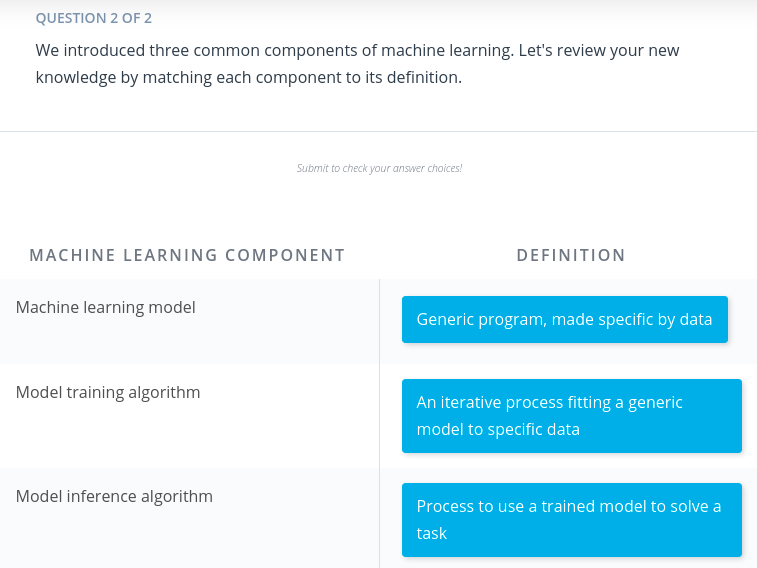
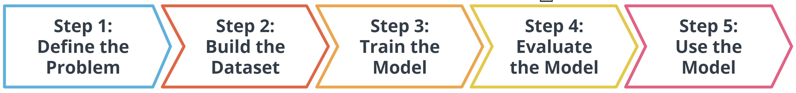

# AWS Machine Learning Foundations Course

**Prerequisites**:

- Introduction to Python
- Introduction to Machine Learning
- Introduction to Deep Learning with PyTorch
- Introduction to Deep Learning with Tensorflow

By the end of the course, you will be able to...

- Explain machine learning and the types of questions machine learning can help to solve.
- Explain what machine learning solutions AWS offers and how AWS AI devices put machine learning in the hands of every developer.
- Apply software engineering principles of modular code, code efficiency, refactoring, documentation, and version control to data science.
- Apply software engineering principles of testing code, logging, and conducting code reviews to data science.
- Implement the basic principles of object-oriented programming to build a Python package.

## Table of Contents

- [AWS Machine Learning Foundations Course](#aws-machine-learning-foundations-course)
  - [Table of Contents](#table-of-contents)
    - [Lesson 2: Introduction to Machine Learning](#lesson-2-introduction-to-machine-learning)
      - [What is Machine Learning](#what-is-machine-learning)
      - [Components of Machine Learning](#components-of-machine-learning)
      - [Quiz - What is Machine Learning](#quiz---what-is-machine-learning)
      - [Introduction to the Five Machine Learning Steps](#introduction-to-the-five-machine-learning-steps)
    - [Lesson 3: Machine Learning with AWS](#lesson-3-machine-learning-with-aws)
    - [Lesson 4: Software Engineering Practices, part 1](#lesson-4-software-engineering-practices-part-1)
    - [Lesson 5: Software Engineering Practices, part 2](#lesson-5-software-engineering-practices-part-2)
    - [Lesson 6: Object-Oriented Programming](#lesson-6-object-oriented-programming)

Course Overview

### Lesson 2: Introduction to Machine Learning

In this lesson, you will learn the fundamentals of supervised and unsupervised machine learning, including the process steps of solving machine learning problems, and explore several examples.

Machine learning is creating rapid and exciting changes across all levels of society.

- It is the engine behind the recent advancements in industries such as **autonomous vehicles**.
- It allows for more accurate and rapid **translation** of the text into hundreds of languages.
- It powers the **AI assistants** you might find in your home.
- It can help **improve worker safety**.
- It can speed up **drug design**.

Machine learning is a complex subject area. Our goal in this lesson is to introduce you to some of the most common **terms** and ideas used in machine learning. I will then walk you through the different steps involved in machine learning and finish with a series of examples that use machine learning to solve real-world situations.

#### What is Machine Learning

`Machine learning (ML)` is a modern **software development technique** and a type of artificial intelligence `(AI)` that enables computers to solve problems by using examples of `real-world data`. It allows computers to automatically `learn` and `improve` from experience without being explicitly programmed to do so.

`Machine learning` is part of the broader field of artificial intelligence. This field is concerned with the capability of machines to perform activities using human-like intelligence. Within machine learning there are several different kinds of tasks or techniques:

- In **supervised learning**, every training sample from the dataset has a corresponding `label or output value` associated with it. As a result, the algorithm learns to **predict** `labels` or `output values`. We will explore this in-depth in this lesson.

- In **unsupervised learning**, there are `no labels` for the training data. A machine learning algorithm tries to learn the underlying `patterns` or `distributions` that govern the data. We will explore this in-depth in this lesson.

- In **reinforcement learning**, the algorithm figures out which `actions to take in a situation to maximize a reward` (in the form of a number) on the way to reaching a specific goal. This is a completely different approach than supervised and unsupervised learning. We will dive deep into this in the next lesson.

In traditional problem-solving with software, a person analyzes a problem and engineers a solution in code to solve that problem. For many real-world problems, this process can be laborious (or even impossible) because a correct solution would need to consider a vast number of edge cases.

Imagine, for example, the challenging task of writing a program that can detect if a cat is present in an image. Solving this in the traditional way would require careful attention to details like varying lighting conditions, different types of cats, and various poses a cat might be in.

In machine learning, the problem solver abstracts away part of their solution as a flexible component called a model, and uses a special program called a model training algorithm to adjust that model to real-world data. The result is a trained model which can be used to predict outcomes that are not part of the data set used to train it.

In a way, machine learning automates some of the statistical reasoning and pattern-matching the problem solver would traditionally do.

The overall goal is to use a model created by a model training algorithm to generate predictions or find patterns in data that can be used to solve a problem.

Machine learning is a new field created at the intersection of statistics, applied math, and computer science. Because of the rapid and recent growth of machine learning, each of these fields might use slightly different formal definitions of the same terms.

#### Components of Machine Learning

A **model** is an extremely generic program, made specific by the data used to train it.

**Model training algorithms** work through an interactive process where the current model iteration is analyzed to determine what changes can be made to get closer to the goal. Those changes are made and the iteration continues until the model is evaluated to meet the goals.

**Model inference** is when the trained model is used to generate predictions.

#### Quiz - What is Machine Learning

#### Introduction to the Five Machine Learning Steps

In the preceding diagram, you can see an outline of the major steps of the machine learning process. Regardless of the specific model or training algorithm used, machine learning practitioners practice a common workflow to accomplish machine learning tasks.

These steps are iterative. In practice, that means that at each step along the process, you review how the process is going. Are things operating as you expected? If not, go back and revisit your current step or previous steps to try and identify the breakdown.

### Lesson 3: Machine Learning with AWS

In this lesson, you will learn about advanced machine learning techniques such as generative AI, reinforcement learning, and computer vision. You will also learn how to train these models with AWS AI/ML services.

### Lesson 4: Software Engineering Practices, part 1

In this lesson, you will learn how to write well-documented, modularized code.

### Lesson 5: Software Engineering Practices, part 2

In this lesson, you will learn how to test your code and log best practices.

### Lesson 6: Object-Oriented Programming

In this lesson, you will learn about this programming style and prepare to write your own Python package.
