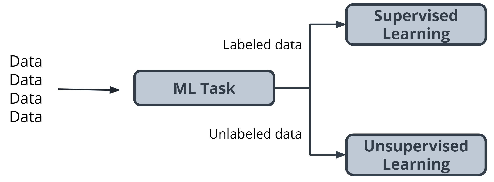
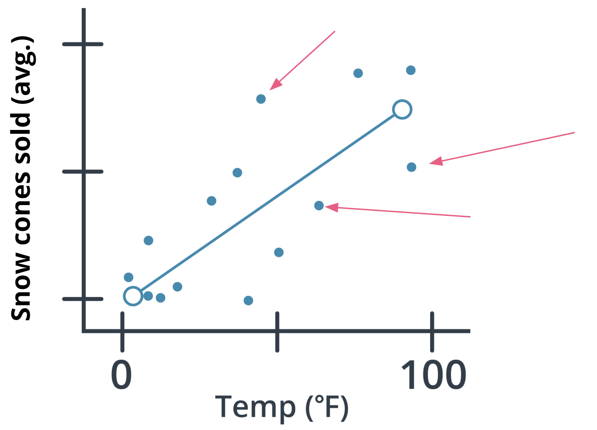
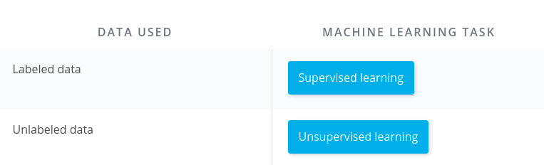
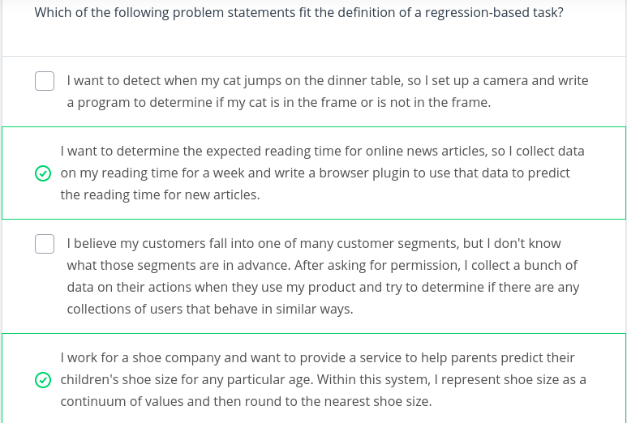
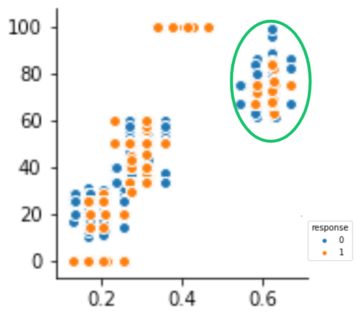
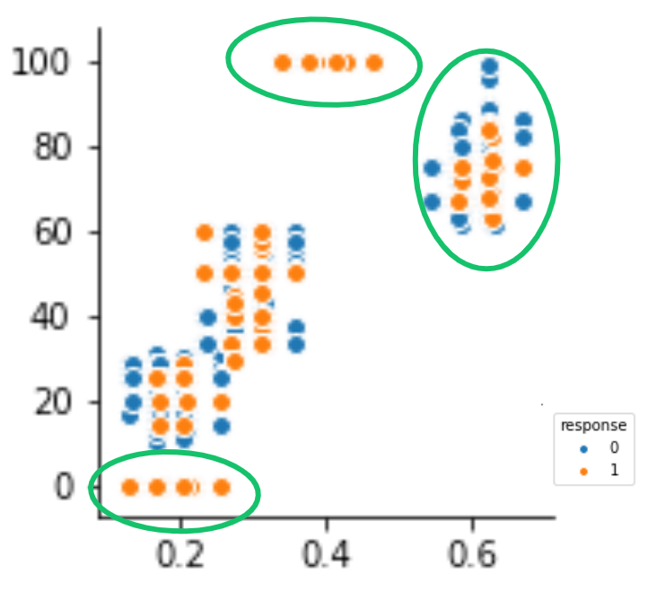
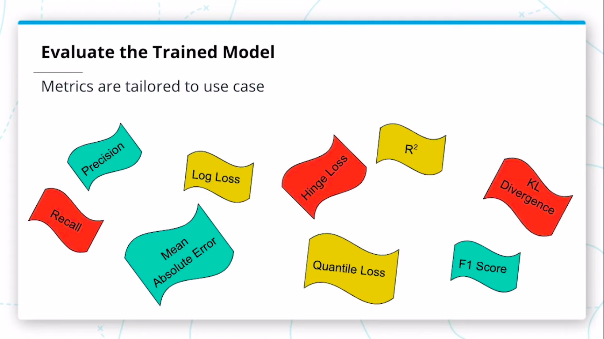
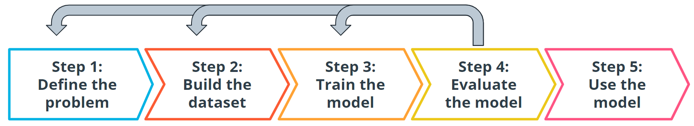
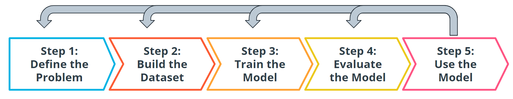

# AWS Machine Learning Foundations Course

**Prerequisites**:

- Introduction to Python
- Introduction to Machine Learning
- Introduction to Deep Learning with PyTorch
- Introduction to Deep Learning with Tensorflow

By the end of the course, you will be able to...

- Explain machine learning and the types of questions machine learning can help to solve.
- Explain what machine learning solutions AWS offers and how AWS AI devices put machine learning in the hands of every developer.
- Apply software engineering principles of modular code, code efficiency, refactoring, documentation, and version control to data science.
- Apply software engineering principles of testing code, logging, and conducting code reviews to data science.
- Implement the basic principles of object-oriented programming to build a Python package.

## Table of Contents

- [AWS Machine Learning Foundations Course](#aws-machine-learning-foundations-course)
  - [Table of Contents](#table-of-contents)
    - [Lesson 2: Introduction to Machine Learning](#lesson-2-introduction-to-machine-learning)
      - [What is Machine Learning](#what-is-machine-learning)
      - [Components of Machine Learning](#components-of-machine-learning)
      - [Quiz - What is Machine Learning](#quiz---what-is-machine-learning)
      - [Introduction to the Five Machine Learning Steps](#introduction-to-the-five-machine-learning-steps)
      - [Define the Problem](#define-the-problem)
      - [Build a Dataset](#build-a-dataset)
      - [Model Training](#model-training)
      - [Model Evaluation](#model-evaluation)
      - [Model Inference](#model-inference)
      - [Introduction to Examples](#introduction-to-examples)
    - [Lesson 3: Machine Learning with AWS](#lesson-3-machine-learning-with-aws)
    - [Lesson 4: Software Engineering Practices, part 1](#lesson-4-software-engineering-practices-part-1)
    - [Lesson 5: Software Engineering Practices, part 2](#lesson-5-software-engineering-practices-part-2)
    - [Lesson 6: Object-Oriented Programming](#lesson-6-object-oriented-programming)

Course Overview

### Lesson 2: Introduction to Machine Learning

In this lesson, you will learn the fundamentals of supervised and unsupervised machine learning, including the process steps of solving machine learning problems, and explore several examples.

Machine learning is creating rapid and exciting changes across all levels of society.

- It is the engine behind the recent advancements in industries such as **autonomous vehicles**.
- It allows for more accurate and rapid **translation** of the text into hundreds of languages.
- It powers the **AI assistants** you might find in your home.
- It can help **improve worker safety**.
- It can speed up **drug design**.

Machine learning is a complex subject area. Our goal in this lesson is to introduce you to some of the most common **terms** and ideas used in machine learning. I will then walk you through the different steps involved in machine learning and finish with a series of examples that use machine learning to solve real-world situations.

#### What is Machine Learning

`Machine learning (ML)` is a modern **software development technique** and a type of artificial intelligence `(AI)` that enables computers to solve problems by using examples of `real-world data`. It allows computers to automatically `learn` and `improve` from experience without being explicitly programmed to do so.

`Machine learning` is part of the broader field of artificial intelligence. This field is concerned with the capability of machines to perform activities using human-like intelligence. Within machine learning there are several different kinds of tasks or techniques:

- In **supervised learning**, every training sample from the dataset has a corresponding `label or output value` associated with it. As a result, the algorithm learns to **predict** `labels` or `output values`. We will explore this in-depth in this lesson.

- In **unsupervised learning**, there are `no labels` for the training data. A machine learning algorithm tries to learn the underlying `patterns` or `distributions` that govern the data. We will explore this in-depth in this lesson.

- In **reinforcement learning**, the algorithm figures out which `actions to take in a situation to maximize a reward` (in the form of a number) on the way to reaching a specific goal. This is a completely different approach than supervised and unsupervised learning. We will dive deep into this in the next lesson.

In traditional problem-solving with software, a person analyzes a problem and engineers a solution in code to solve that problem. For many real-world problems, this process can be laborious (or even impossible) because a correct solution would need to consider a vast number of edge cases.

Imagine, for example, the challenging task of writing a program that can detect if a cat is present in an image. Solving this in the traditional way would require careful attention to details like varying lighting conditions, different types of cats, and various poses a cat might be in.

In machine learning, the problem solver abstracts away part of their solution as a flexible component called a model, and uses a special program called a model training algorithm to adjust that model to real-world data. The result is a trained model which can be used to predict outcomes that are not part of the data set used to train it.

In a way, machine learning automates some of the statistical reasoning and pattern-matching the problem solver would traditionally do.

The overall goal is to use a model created by a model training algorithm to generate predictions or find patterns in data that can be used to solve a problem.

Machine learning is a new field created at the intersection of statistics, applied math, and computer science. Because of the rapid and recent growth of machine learning, each of these fields might use slightly different formal definitions of the same terms.

#### Components of Machine Learning

A **model** is an extremely generic program, made specific by the data used to train it.

**Model training algorithms** work through an interactive process where the current model iteration is analyzed to determine what changes can be made to get closer to the goal. Those changes are made and the iteration continues until the model is evaluated to meet the goals.

**Model inference** is when the trained model is used to generate predictions.

#### Quiz - What is Machine Learning

#### Introduction to the Five Machine Learning Steps

In the preceding diagram, you can see an outline of the major steps of the machine learning process. Regardless of the specific model or training algorithm used, machine learning practitioners practice a common workflow to accomplish machine learning tasks.

These steps are iterative. In practice, that means that at each step along the process, you review how the process is going. Are things operating as you expected? If not, go back and revisit your current step or previous steps to try and identify the breakdown.

#### Define the Problem

**How do You Start a Machine Learning Task?**

- **Define a very specific task.**

  - Think back to the snow cone sales example. Now imagine that you own a frozen treats store and you sell snow cones along with many other products. You wonder, "‘How do I increase sales?" It's a valid question, but it's the opposite of a very specific task. The following examples demonstrate how a machine learning practitioner might attempt to answer that question.
    - “Does adding a $1.00 charge for sprinkles on a hot fudge sundae increase the sales of hot fudge sundaes?”
    - “Does adding a $0.50 charge for organic flavors in your snow cone increase the sales of snow cones?”

- **Identify the machine learning task we might use to solve this problem.**
  - This helps you better understand the data you need for a project.

**What is a Machine Learning Task?**

All model training algorithms, and the models themselves, take data as their input. Their outputs can be very different and are classified into a few different groups based on the task they are designed to solve. Often, we use the kind of data required to train a model as part of defining a machine learning task.

In this lesson, we will focus on two common machine learning tasks:

- **Supervised** learning
- **Unsupervised** learning

**Supervised and Unsupervised Learning**

The presence or absence of labeling in your data is often used to identify a machine learning task.

**Supervised tasks**

A task is supervised if you are using labeled data. We use the term labeled to refer to data that already contains the solutions, called labels.

In the preceding graph, the data contains both a temperature and the number of snow cones sold. Both components are used to generate the linear regression shown on the graph. Our goal was to predict the number of snow cones sold, and we feed that value into the model. We are providing the model with labeled data and therefore, we are performing a supervised machine learning task.

**Unsupervised tasks**

A task is considered to be unsupervised if you are using unlabeled data. This means you don't need to provide the model with any kind of label or solution while the model is being trained.

Let's take a look at unlabeled data.

|  |  |
| --------------------------- | -------------------------- |

- Take a look at the preceding picture. Did you notice the tree in the picture? What you just did, when you noticed the object in the picture and identified it as a tree, is called labeling the picture. Unlike you, a computer just sees that image as a matrix of pixels of varying intensity.
- Since this image does not have the labeling in its original data, it is considered unlabeled.

**How do we classify tasks when we don't have a label?**

Unsupervised learning involves using data that doesn't have a label. One common task is called **clustering**. Clustering helps to determine if there are any naturally occurring groupings in the data.

Let's look at an example of how clustering in unlabeled data works.

Identifying book micro-genres with unsupervised learning

Imagine that you work for a company that recommends books to readers.

The assumption: You are fairly confident that micro-genres exist, and that there is one called Teen Vampire Romance. Because you don’t know which micro-genres exist, you can't use **supervised learning** techniques.

This is where the **unsupervised learning** clustering technique might be able to detect some groupings in the data. The words and phrases used in the book description might provide some guidance on a book's micro-genre.

**Further Classifying by using Label Types**

Initially, we divided tasks based on the presence or absence of labeled data while training our model. Often, tasks are further defined by the type of label which is present.

In **supervised** learning, there are two main identifiers you will see in machine learning:

- A **categorical** label has a discrete set of possible values. In a machine learning problem in which you want to identify the type of flower based on a picture, you would train your model using images that have been labeled with the categories of flower you would want to identify. Furthermore, when you work with categorical labels, you often carry out **classification** tasks\*, which are part of the supervised learning family.
- A continuous (**regression**) label does not have a discrete set of possible values, which often means you are working with numerical data. In the snow cone sales example, we are trying to predict the number\* of snow cones sold. Here, our label is a number that could, in theory, be any value.

In unsupervised learning, **clustering** is just one example. There are many other options, such as deep learning.

**Terminology**:

- **Clustering**. Unsupervised learning task that helps to determine if there are any naturally occurring groupings in the data.
- A **categorical** label has a discrete set of possible values, such as "is a cat" and "is not a cat."
- A **continuous** (regression) label does not have a discrete set of possible values, which means possibly an unlimited number of possibilities.
- **Discrete**: A term taken from statistics referring to an outcome taking on only a finite number of values (such as days of the week).
- A **label** refers to data that already contains the solution.
- Using **unlabeled** data means you don't need to provide the model with any kind of label or solution while the

**Additional Reading**:

- The [AWS Machine Learning blog](https://aws.amazon.com/blogs/machine-learning/) is a great resource for learning more about projects in machine learning.
- You can use [Amazon SageMaker to calculate new stats in Major League Baseball](https://aws.amazon.com/blogs/machine-learning/calculating-new-stats-in-major-league-baseball-with-amazon-sagemaker/).
- You can also find an article on [Flagging suspicious healthcare claims with Amazon SageMaker](https://aws.amazon.com/blogs/machine-learning/flagging-suspicious-healthcare-claims-with-amazon-sagemaker/) on the AWS Machine Learning blog.
- [What kinds of questions and problems are good for machine learning?](https://docs.aws.amazon.com/machine-learning/latest/dg/machine-learning-problems-in-amazon-machine-learning.html)

**Quiz**:

#### Build a Dataset

**The most important step of the machine learning process**

Working with data is perhaps the most overlooked—yet most important—step of the machine learning process. In 2017, an O’Reilly study showed that machine learning practitioners spend 80% of their time working with their data.

**The Four Aspects of Working with Data**

You can take an entire class just on working with, understanding, and processing data for machine learning applications. Good, high-quality data is essential for any kind of machine learning project. Let's explore some of the common aspects of working with data.

**Data collection**

Data collection can be as straightforward as running the appropriate SQL queries or as complicated as building custom web scraper applications to collect data for your project. You might even have to run a model over your data to generate needed labels. Here is the fundamental question:

> Does the data you've collected match the machine learning task and problem you have defined?

**Data inspection**

The quality of your data will ultimately be the largest factor that affects how well you can expect your model to perform. As you inspect your data, look for:

- **Outliers**
- **Missing** or **incomplete** values
- Data that needs to be **transformed** or **preprocessed** so it's in the correct format to be used by your model.

**Summary statistics**

Models can assume how your data is structured.

Now that you have some data in hand it is a good best practice to check that your data is in line with the underlying assumptions of your chosen machine learning model.

With many statistical tools, you can calculate things like the `mean`, inner-quartile range (`IQR`), and `standard deviation`. These tools can give you insight into the `scope`, `scale`, and `shape` of the dataset.

**Data visualization**

You can use data visualization to see outliers and trends in your data and to help stakeholders understand your data.

Look at the following two graphs. In the first graph, some data seems to have clustered into different groups. In the second graph, some data points might be outliers.

|                   |                  |
| ------------------------------------------- | ------------------------------------------- |
| Some of the data seems to cluster in groups | Some of the data points seem to be outliers |

In this lesson, you will learn about advanced machine learning techniques such as generative AI, reinforcement learning, and computer vision. You will also learn how to train these models with AWS AI/ML services.

**Terminology**

- **Impute** is a common term referring to different statistical tools which can be used to calculate missing values from your dataset.
- **Outliers** are data points that are significantly different from others in the same sample.

[Outlier Detection on Real Dataset](https://scikit-learn.org/stable/auto_examples/applications/plot_outlier_detection_wine.html)

#### Model Training

You're ready to start training your first model.

**Splitting your Dataset**:

The first step in model training is to `randomly split the dataset`. This allows you to keep some `data hidden during training`, so that data can be used to **evaluate** your **model** before you put it into production. Specifically, you do this to test against the `bias-variance trade-off`. If you're interested in learning more, see the Further learning and reading section.

Splitting your dataset gives you two sets of data:

- **Training dataset**: The data on which the model will be trained. Most of your data will be here. Many developers estimate about **80%**.
- **Test dataset**: The data withheld from the model during training, which is used to test how well your model will generalize to new data.

**Model Training Terminology**:

> The model training algorithm iteratively updates a model's parameters to minimize some loss function.

Let's define those two terms:

- **Model parameters**: Model parameters are settings or configurations the training algorithm can update to change how the model behaves. Depending on the context, you’ll also hear other more specific terms used to describe model parameters such as **weights** and **biases**. Weights, which are values that change as the model learns, are more specific to neural networks.

- **Loss function**: A loss function is used to codify the model’s `distance from this goal`. For example, if you were trying to predict a number of snow cone sales based on the day’s weather, you would care about making predictions that are as accurate as possible. So you might define a loss function to be “the average distance between your model’s predicted number of snow cone sales and the correct number.” You can see in the snow cone example this is the difference between the two purple dots.

**Putting it All Together**:

The end-to-end training process is

- `Feed the training data into the model`.
- `Compute the loss` function on the results.
- Update the model **parameters** in a direction that reduces loss.

You continue to cycle through these steps until you reach a predefined stop condition. This might be based on a training time, the number of training cycles, or an even more intelligent or application-aware mechanism.

**Advice From the Experts**:

Remember the following advice when training your model.

1. Practitioners often use machine learning **frameworks** that already have working implementations of models and model training algorithms. You could implement these from scratch, but you probably won't need to do so unless you’re developing new models or algorithms.
2. Practitioners use a process called **model selection** to determine which model or models to use. The list of established models is constantly growing, and even seasoned machine learning practitioners may try many different types of models while solving a problem with machine learning.
3. **Hyperparameters** are settings on the model which are
   `not changed during training` but can affect how quickly or how reliably the model trains, such as the number of clusters the model should identify.
4. Be prepared to **iterate**.

_Pragmatic problem solving with machine learning is rarely an exact science, and you might have assumptions about your data or problem which turn out to be false. Don’t get discouraged. Instead, foster a habit of trying new things, measuring success, and comparing results across iterations._

**Extended Learning**:

This information hasn't been covered in the above video but is provided for the advanced reader.

- **Linear models**: One of the most common models covered in introductory coursework, linear models simply describe the **relationship between a set of input numbers and a set of output** numbers through a linear function (think of y = mx + b or a line on a x vs y chart).

**Classification** tasks often use a strongly related **logistic** model, which adds an additional transformation mapping the output of the linear function to the range `[0, 1]`, interpreted as `“probability of being in the target class.”` Linear models are fast to train and give you a great baseline against which to compare more complex models. A lot of media buzz is given to more complex models, but for most new problems, consider starting with a simple model.

- **Tree-based models**: Tree-based models are probably the second most common model type covered in introductory coursework. They learn to **categorize or regress** by building an extremely large structure of nested if/else blocks, splitting the world into different regions at each if/else block. Training determines exactly where these splits happen and what value is assigned at each leaf region.

For example, if you’re trying to determine if a light sensor is in sunlight or shadow, you might train tree of depth 1 with the final learned configuration being something like if (sensor_value > 0.698), then return 1; else return 0;. The tree-based model XGBoost is commonly used as an off-the-shelf implementation for this kind of model and includes enhancements beyond what is discussed here. Try tree-based models to quickly get a baseline before moving on to more complex models.

- **Deep learning models**: Extremely popular and powerful, deep learning is a modern approach based around a conceptual model of how the human brain functions. The model (also called a neural network) is composed of collections of neurons (very simple computational units) connected together by weights (mathematical representations of how much information to allow to flow from one neuron to the next). The process of training involves finding values for each **weight**.

Various neural network structures have been determined for modeling different kinds of problems or processing different kinds of data.

A short (but not complete!) list of noteworthy examples includes:

- **FFNN**: The most straightforward way of structuring a neural network, the Feed Forward Neural Network (FFNN) structures neurons in a series of layers, with each neuron in a layer containing weights to all neurons in the previous layer.
- **CNN**: Convolutional Neural Networks (CNN) represent nested filters over grid-organized data. They are by far the most commonly used type of model when processing images.
- **RNN/LSTM**: Recurrent Neural Networks (RNN) and the related Long Short-Term Memory (LSTM) model types are structured to effectively represent for loops in traditional computing, collecting state while iterating over some object. They can be used for processing sequences of data.
- **Transformer**: A more modern replacement for RNN/LSTMs, the transformer architecture enables training over larger datasets involving sequences of data.

**Machine Learning Using Python Libraries**:

For more classical models (`linear`, `tree-based`) as well as a set of common ML-related tools, take a look at **scikit-learn**. The web documentation for this library is also organized for those getting familiar with space and can be a great place to get familiar with some extremely useful tools and techniques.
For **deep learning**, **mxnet**, **tensorflow**, and **pytorch** are the three most common libraries. For the purposes of the majority of machine learning needs, each of these is feature-paired and equivalent.

**Terminology**:

- **Hyperparameters** are settings on the model which are not changed during training but can affect how quickly or how reliably the model trains, such as the number of clusters the model should identify.

- A **loss function** is used to codify the model’s distance from this goal

- **Training dataset**: The data on which the model will be trained. Most of your data will be here.

- **Test dataset**: The data withheld from the model during training, which is used to test how well your model will generalize to new data.

- **Model parameters** are settings or configurations the training algorithm can update to change how the model behaves.

#### Model Evaluation

After you have collected your data and trained a model, you can start to evaluate how well your model is performing. The metrics used for evaluation are likely to be very specific to the problem you have defined. As you grow in your understanding of machine learning, you will be able to explore a wide variety of metrics that can enable you to evaluate effectively.

**Using `Model Accuracy`**

Model accuracy is a fairly common evaluation metric.
`Accuracy is the fraction of predictions a model gets right`.

Imagine that you built a model to identify a flower as one of two common species based on measurable details like petal length. You want to know how often your model predicts the correct species. This would require you to look at your model's accuracy.

**Extend Learning**:

- **Using Log Loss**: Log loss seeks to calculate how uncertain your model is about the predictions it is generating. In this context, uncertainty refers to how likely a model thinks the predictions being generated are to be correct.

Here's an example:

For example, let's say you're trying to predict how likely a customer is to buy either a jacket or t-shirt.

`Log loss could be used to understand your model's uncertainty about a given prediction`. In a single instance, your model could predict with 5% certainty that a customer is going to buy a t-shirt. In another instance, your model could predict with 80% certainty that a customer is going to buy a t-shirt. Log loss enables you to measure how strongly the model believes that its prediction is accurate.

In both cases, the model predicts that a customer will buy a t-shirt, but the model's certainty about that prediction can change.

**Remember This process is iterative**:

Every step we have gone through is highly iterative and can be changed or re-scoped during the course of a project. At each step, you might find that you need to go back and reevaluate some assumptions you had in previous steps. Don't worry! This ambiguity is normal.

**Terminology**:

- **Log loss** seeks to calculate how uncertain your model is about the predictions it is generating.

- **Model Accuracy** is the fraction of predictions a model gets right.

**Additional Reading**:

[Predicting Orthopedic Pathology](https://aws.amazon.com/blogs/machine-learning/create-a-model-for-predicting-orthopedic-pathology-using-amazon-sagemaker/)

#### Model Inference

Congratulations! You're ready to deploy your model.

Once you have trained your model, have evaluated its effectiveness, and are satisfied with the results, you're ready to generate predictions on real-world problems using unseen data in the field. In machine learning, this process is often called **inference**.

Even after you deploy your model, you're always **monitoring** to make sure your model is producing the kinds of results that you expect. There may be times where you reinvestigate the data, modify some of the parameters in your model training algorithm, or even change the model type used for training.

#### Introduction to Examples

Through the remainder of the lesson, we will be walking through 3 different case study examples of machine learning tasks actually solving problems in the real world.

- **Supervised learning**: Using machine learning to predict housing prices in a neighborhood based on lot size and number of bedrooms
- **Unsupervised learning**: Using machine learning to isolate micro-genres of books by analyzing the wording on the back cover description.
- **Deep neural network**: While this type of task is beyond the scope of this lesson, we wanted to show you the power and versatility of modern machine learning. You will see how it can be used to analyze raw images from lab video footage from security cameras, trying to detect chemical spills.

### Lesson 3: Machine Learning with AWS

### Lesson 4: Software Engineering Practices, part 1

In this lesson, you will learn how to write well-documented, modularized code.

### Lesson 5: Software Engineering Practices, part 2

In this lesson, you will learn how to test your code and log best practices.

### Lesson 6: Object-Oriented Programming

In this lesson, you will learn about this programming style and prepare to write your own Python package.
