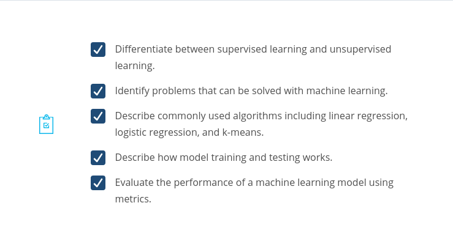
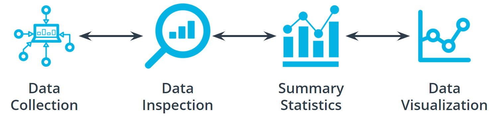

# AWS Machine Learning Foundations Course

**Prerequisites**:

- Introduction to Python
- Introduction to Machine Learning
- Introduction to Deep Learning with PyTorch
- Introduction to Deep Learning with Tensorflow

By the end of the course, you will be able to...

- Explain machine learning and the types of questions machine learning can help to solve.
- Explain what machine learning solutions AWS offers and how AWS AI devices put machine learning in the hands of every developer.
- Apply software engineering principles of modular code, code efficiency, refactoring, documentation, and version control to data science.
- Apply software engineering principles of testing code, logging, and conducting code reviews to data science.
- Implement the basic principles of object-oriented programming to build a Python package.

## Table of Contents

- [AWS Machine Learning Foundations Course](#aws-machine-learning-foundations-course)
  - [Table of Contents](#table-of-contents)
    - [Lesson 2: Introduction to Machine Learning](#lesson-2-introduction-to-machine-learning)
      - [What is Machine Learning](#what-is-machine-learning)
      - [Components of Machine Learning](#components-of-machine-learning)
      - [Quiz - What is Machine Learning](#quiz---what-is-machine-learning)
      - [Introduction to the Five Machine Learning Steps](#introduction-to-the-five-machine-learning-steps)
      - [Define the Problem](#define-the-problem)
      - [Build a Dataset](#build-a-dataset)
    - [Lesson 3: Machine Learning with AWS](#lesson-3-machine-learning-with-aws)
    - [Lesson 4: Software Engineering Practices, part 1](#lesson-4-software-engineering-practices-part-1)
    - [Lesson 5: Software Engineering Practices, part 2](#lesson-5-software-engineering-practices-part-2)
    - [Lesson 6: Object-Oriented Programming](#lesson-6-object-oriented-programming)

Course Overview

### Lesson 2: Introduction to Machine Learning

In this lesson, you will learn the fundamentals of supervised and unsupervised machine learning, including the process steps of solving machine learning problems, and explore several examples.

Machine learning is creating rapid and exciting changes across all levels of society.

- It is the engine behind the recent advancements in industries such as **autonomous vehicles**.
- It allows for more accurate and rapid **translation** of the text into hundreds of languages.
- It powers the **AI assistants** you might find in your home.
- It can help **improve worker safety**.
- It can speed up **drug design**.

Machine learning is a complex subject area. Our goal in this lesson is to introduce you to some of the most common **terms** and ideas used in machine learning. I will then walk you through the different steps involved in machine learning and finish with a series of examples that use machine learning to solve real-world situations.

#### What is Machine Learning

`Machine learning (ML)` is a modern **software development technique** and a type of artificial intelligence `(AI)` that enables computers to solve problems by using examples of `real-world data`. It allows computers to automatically `learn` and `improve` from experience without being explicitly programmed to do so.

`Machine learning` is part of the broader field of artificial intelligence. This field is concerned with the capability of machines to perform activities using human-like intelligence. Within machine learning there are several different kinds of tasks or techniques:

- In **supervised learning**, every training sample from the dataset has a corresponding `label or output value` associated with it. As a result, the algorithm learns to **predict** `labels` or `output values`. We will explore this in-depth in this lesson.

- In **unsupervised learning**, there are `no labels` for the training data. A machine learning algorithm tries to learn the underlying `patterns` or `distributions` that govern the data. We will explore this in-depth in this lesson.

- In **reinforcement learning**, the algorithm figures out which `actions to take in a situation to maximize a reward` (in the form of a number) on the way to reaching a specific goal. This is a completely different approach than supervised and unsupervised learning. We will dive deep into this in the next lesson.

In traditional problem-solving with software, a person analyzes a problem and engineers a solution in code to solve that problem. For many real-world problems, this process can be laborious (or even impossible) because a correct solution would need to consider a vast number of edge cases.

Imagine, for example, the challenging task of writing a program that can detect if a cat is present in an image. Solving this in the traditional way would require careful attention to details like varying lighting conditions, different types of cats, and various poses a cat might be in.

In machine learning, the problem solver abstracts away part of their solution as a flexible component called a model, and uses a special program called a model training algorithm to adjust that model to real-world data. The result is a trained model which can be used to predict outcomes that are not part of the data set used to train it.

In a way, machine learning automates some of the statistical reasoning and pattern-matching the problem solver would traditionally do.

The overall goal is to use a model created by a model training algorithm to generate predictions or find patterns in data that can be used to solve a problem.

Machine learning is a new field created at the intersection of statistics, applied math, and computer science. Because of the rapid and recent growth of machine learning, each of these fields might use slightly different formal definitions of the same terms.

#### Components of Machine Learning

A **model** is an extremely generic program, made specific by the data used to train it.

**Model training algorithms** work through an interactive process where the current model iteration is analyzed to determine what changes can be made to get closer to the goal. Those changes are made and the iteration continues until the model is evaluated to meet the goals.

**Model inference** is when the trained model is used to generate predictions.

#### Quiz - What is Machine Learning

#### Introduction to the Five Machine Learning Steps

In the preceding diagram, you can see an outline of the major steps of the machine learning process. Regardless of the specific model or training algorithm used, machine learning practitioners practice a common workflow to accomplish machine learning tasks.

These steps are iterative. In practice, that means that at each step along the process, you review how the process is going. Are things operating as you expected? If not, go back and revisit your current step or previous steps to try and identify the breakdown.

#### Define the Problem

**How do You Start a Machine Learning Task?**

- **Define a very specific task.**

  - Think back to the snow cone sales example. Now imagine that you own a frozen treats store and you sell snow cones along with many other products. You wonder, "‘How do I increase sales?" It's a valid question, but it's the opposite of a very specific task. The following examples demonstrate how a machine learning practitioner might attempt to answer that question.
    - “Does adding a $1.00 charge for sprinkles on a hot fudge sundae increase the sales of hot fudge sundaes?”
    - “Does adding a $0.50 charge for organic flavors in your snow cone increase the sales of snow cones?”

- **Identify the machine learning task we might use to solve this problem.**
  - This helps you better understand the data you need for a project.

**What is a Machine Learning Task?**

All model training algorithms, and the models themselves, take data as their input. Their outputs can be very different and are classified into a few different groups based on the task they are designed to solve. Often, we use the kind of data required to train a model as part of defining a machine learning task.

In this lesson, we will focus on two common machine learning tasks:

- **Supervised** learning
- **Unsupervised** learning

**Supervised and Unsupervised Learning**

The presence or absence of labeling in your data is often used to identify a machine learning task.

**Supervised tasks**

A task is supervised if you are using labeled data. We use the term labeled to refer to data that already contains the solutions, called labels.

In the preceding graph, the data contains both a temperature and the number of snow cones sold. Both components are used to generate the linear regression shown on the graph. Our goal was to predict the number of snow cones sold, and we feed that value into the model. We are providing the model with labeled data and therefore, we are performing a supervised machine learning task.

**Unsupervised tasks**

A task is considered to be unsupervised if you are using unlabeled data. This means you don't need to provide the model with any kind of label or solution while the model is being trained.

Let's take a look at unlabeled data.

|  |  |
| --------------------------- | -------------------------- |

- Take a look at the preceding picture. Did you notice the tree in the picture? What you just did, when you noticed the object in the picture and identified it as a tree, is called labeling the picture. Unlike you, a computer just sees that image as a matrix of pixels of varying intensity.
- Since this image does not have the labeling in its original data, it is considered unlabeled.

**How do we classify tasks when we don't have a label?**

Unsupervised learning involves using data that doesn't have a label. One common task is called **clustering**. Clustering helps to determine if there are any naturally occurring groupings in the data.

Let's look at an example of how clustering in unlabeled data works.

Identifying book micro-genres with unsupervised learning

Imagine that you work for a company that recommends books to readers.

The assumption: You are fairly confident that micro-genres exist, and that there is one called Teen Vampire Romance. Because you don’t know which micro-genres exist, you can't use **supervised learning** techniques.

This is where the **unsupervised learning** clustering technique might be able to detect some groupings in the data. The words and phrases used in the book description might provide some guidance on a book's micro-genre.

**Further Classifying by using Label Types**

Initially, we divided tasks based on the presence or absence of labeled data while training our model. Often, tasks are further defined by the type of label which is present.

In **supervised** learning, there are two main identifiers you will see in machine learning:

- A **categorical** label has a discrete set of possible values. In a machine learning problem in which you want to identify the type of flower based on a picture, you would train your model using images that have been labeled with the categories of flower you would want to identify. Furthermore, when you work with categorical labels, you often carry out **classification** tasks\*, which are part of the supervised learning family.
- A continuous (**regression**) label does not have a discrete set of possible values, which often means you are working with numerical data. In the snow cone sales example, we are trying to predict the number\* of snow cones sold. Here, our label is a number that could, in theory, be any value.

In unsupervised learning, **clustering** is just one example. There are many other options, such as deep learning.

**Terminology**:

- **Clustering**. Unsupervised learning task that helps to determine if there are any naturally occurring groupings in the data.
- A **categorical** label has a discrete set of possible values, such as "is a cat" and "is not a cat."
- A **continuous** (regression) label does not have a discrete set of possible values, which means possibly an unlimited number of possibilities.
- **Discrete**: A term taken from statistics referring to an outcome taking on only a finite number of values (such as days of the week).
- A **label** refers to data that already contains the solution.
- Using **unlabeled** data means you don't need to provide the model with any kind of label or solution while the

**Additional Reading**:

- The [AWS Machine Learning blog](https://aws.amazon.com/blogs/machine-learning/) is a great resource for learning more about projects in machine learning.
- You can use [Amazon SageMaker to calculate new stats in Major League Baseball](https://aws.amazon.com/blogs/machine-learning/calculating-new-stats-in-major-league-baseball-with-amazon-sagemaker/).
- You can also find an article on [Flagging suspicious healthcare claims with Amazon SageMaker](https://aws.amazon.com/blogs/machine-learning/flagging-suspicious-healthcare-claims-with-amazon-sagemaker/) on the AWS Machine Learning blog.
- [What kinds of questions and problems are good for machine learning?](https://docs.aws.amazon.com/machine-learning/latest/dg/machine-learning-problems-in-amazon-machine-learning.html)

**Quiz**:

#### Build a Dataset

**The most important step of the machine learning process**

Working with data is perhaps the most overlooked—yet most important—step of the machine learning process. In 2017, an O’Reilly study showed that machine learning practitioners spend 80% of their time working with their data.

**The Four Aspects of Working with Data**

You can take an entire class just on working with, understanding, and processing data for machine learning applications. Good, high-quality data is essential for any kind of machine learning project. Let's explore some of the common aspects of working with data.

**Data collection**

Data collection can be as straightforward as running the appropriate SQL queries or as complicated as building custom web scraper applications to collect data for your project. You might even have to run a model over your data to generate needed labels. Here is the fundamental question:

> Does the data you've collected match the machine learning task and problem you have defined?

**Data inspection**

The quality of your data will ultimately be the largest factor that affects how well you can expect your model to perform. As you inspect your data, look for:

- **Outliers**
- **Missing** or **incomplete** values
- Data that needs to be **transformed** or **preprocessed** so it's in the correct format to be used by your model.

**Summary statistics**

Models can assume how your data is structured.

Now that you have some data in hand it is a good best practice to check that your data is in line with the underlying assumptions of your chosen machine learning model.

With many statistical tools, you can calculate things like the `mean`, inner-quartile range (`IQR`), and `standard deviation`. These tools can give you insight into the `scope`, `scale`, and `shape` of the dataset.

**Data visualization**

You can use data visualization to see outliers and trends in your data and to help stakeholders understand your data.

Look at the following two graphs. In the first graph, some data seems to have clustered into different groups. In the second graph, some data points might be outliers.

|                   |                  |
| ------------------------------------------- | ------------------------------------------- |
| Some of the data seems to cluster in groups | Some of the data points seem to be outliers |

In this lesson, you will learn about advanced machine learning techniques such as generative AI, reinforcement learning, and computer vision. You will also learn how to train these models with AWS AI/ML services.

**Terminology**

- **Impute** is a common term referring to different statistical tools which can be used to calculate missing values from your dataset.
- **Outliers** are data points that are significantly different from others in the same sample.

[Outlier Detection on Real Dataset](https://scikit-learn.org/stable/auto_examples/applications/plot_outlier_detection_wine.html)

### Lesson 3: Machine Learning with AWS

### Lesson 4: Software Engineering Practices, part 1

In this lesson, you will learn how to write well-documented, modularized code.

### Lesson 5: Software Engineering Practices, part 2

In this lesson, you will learn how to test your code and log best practices.

### Lesson 6: Object-Oriented Programming

In this lesson, you will learn about this programming style and prepare to write your own Python package.
