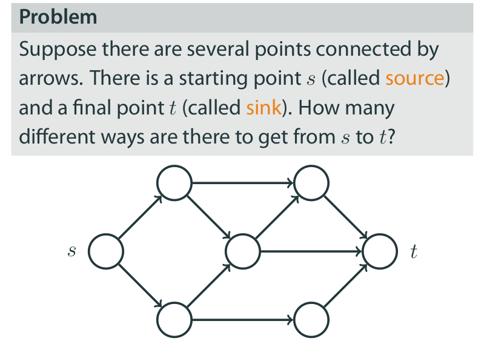

# Discrete Math and Analyzing Social Graphs

[Course Link](https://www.coursera.org/learn/discrete-math-and-analyzing-social-graphs/home/welcome)

## Table of Contents

- [Discrete Math and Analyzing Social Graphs](#discrete-math-and-analyzing-social-graphs)
  - [Table of Contents](#table-of-contents)
    - [Basic Combinatorics](#basic-combinatorics)
      - [Why Counting](#why-counting)
      - [Rule of Sum](#rule-of-sum)
      - [Convenient Language: Sets](#convenient-language-sets)
      - [Generalized Rule of Sum](#generalized-rule-of-sum)
      - [Recursive Counting: Number of Paths](#recursive-counting-number-of-paths)
      - [Rule of Product](#rule-of-product)

### Basic Combinatorics

Suppose we need to **count** certain objects. Can we do anything better than just list all the objects? Do we need to create a list of all our data entries to check whether we have enough data to teach our ML model? Is there a way to tell whether our algorithm will run in a reasonable **time** before implementing and actually running it? All these questions are addressed by a mathematical field called **Combinatorics**. In this module we will give an introduction to this field that will help us to answer basic versions of the above questions.

**Learning Objectives**:

- Use basic methods of `combinatorics to count` objects.
- Apply standard operations on `sets`.
- `Categorize basic combinatorial` problems into standard settings.
- Apply basic `combinatorial methods` in programming.

[Slides Link](https://d3c33hcgiwev3.cloudfront.net/ixF2zIsPRmuRdsyLDyZrdQ_2d9654a3d8414750818f3bdaf93b3cab_basic_counting_tecniques.pdf?Expires=1623974400&Signature=Ao9Q8cxzE7jgN9IOsjvc602Ho3W32d9oQHQqSHLZhlEVYqTUGmjcjnwZlRkr8j2f3PnCLWZiXZgtrZttiMk8d5DyDbFdSzE8JYHcbPYmSH~aO2wAlZdClwwTJyuCjYiNimGtU1RL5C8zIGFaInrZ22nSc-hiUrE8lCANZm3Ngoc_&Key-Pair-Id=APKAJLTNE6QMUY6HBC5A)

#### Why Counting


#### Rule of Sum


**Rule of Sum in Programming**:

```js
for _ in range(8):
        print("Hi!")
for _ in range(4):
        print("Hi!")
for _ in range(7):
        print("Hi!")
```

If we run this code, how many times the word 'Hi!' will be printed? Try to answer without actually running the code.

**Answer**: 8 + 4 + 7 = 19

**Numbers Divisible by 2 or 3**

```py
# Number Divisible by 2
# How many numbers from 1 to 20, inclusive, are divisible by 2?
# How many numbers from 1 to 20, inclusive, are divisible by 3?
# How many numbers from 1 to 20, inclusive, are divisible by 2 or by 3?

divisible_by_2 = 0
divisible_by_3 = 0
divisible_by_2_or_3 = 0

for i in range(1,21):
    if i % 2 == 0:
        divisible_by_2 += 1

    if i % 3 == 0:
        divisible_by_3 += 1

    if i % 2 == 0 or i % 3 == 0:
        divisible_by_2_or_3 += 1

print(divisible_by_2) # 10
print(divisible_by_3) # 6
print(divisible_by_2_or_3) # 13
```

#### Convenient Language: Sets


How many elements does the set `A={1,1,1,1}` contain?
**Answer**: `1`


```py
# Consider the set A={1,3,2,0,1,3}. Find ∣A∣.
A = {1,3,2,0,1,3}

# length of |A|
print(len(A)) # 4

# subset
A = {1,3,4,7,10,11}

# =============== Subset ==================== #
# Checking if A is subset of B (vice versa)
# Returns True
# A is subset of B
B = {1, 7, 11}
print(B.issubset(A)) # True

B = {1, 3, 4, 8}
print(B.issubset(A)) # False

B = set()
print(B.issubset(A)) # True

B = {1, 3, 4, 7, 10, 11}
print(B.issubset(A)) # True

# =========== Intersection and Union ================== #
A = {1,2,4,5,6}
B = {1,2,3,5,7}

print(A.intersection(B)) # {1,2,5}
print(A.union(B)) # {1,2,3,4,5,6,7}

# =============== Element  ================ #
# If some object 𝑥 is an element of 𝐴 we write 𝑥 ∈ 𝐴
print (2 in A) # True
print(3 in B) # True
print(3 in A) # False
```

#### Generalized Rule of Sum

If there are finite sets `𝐴` and `𝐵`, then `|𝐴 ∪ 𝐵| = |𝐴| + |𝐵| − |𝐴 ∩ 𝐵|`


- Suppose we have 40 videos in our dataset. Each video falls in at least one of the two categories, comedy videos and music videos. It is known that there are 27 comedy videos and 22 music videos in the dataset. How many videos fall into both categories?

```py
# Rule of Sum
# If there are finite sets 𝐴 and 𝐵, then |𝐴 ∪ 𝐵| = |𝐴| + |𝐵| − |𝐴 ∩ 𝐵|

# Here,
# |A U B| = ?
# |A| = 27
# |B| = 22

# According to general rule of sum,

fall_into_both_categories = 27 + 22 - 40
print(fall_into_both_categories) # 9
```

#### Recursive Counting: Number of Paths




**Question**:


**Answer**: 3 + 2 + 3 => 8


#### Rule of Product

If there are `𝑘` object of the first type and there are `𝑛` object of the second type, then there are `𝑘 × 𝑛` **pairs** of objects, the first of the first type and the second of the second type.


```py
# Question 1
# Suppose we have "7" disjoint datasets and each dataset contains
"12" data entries. How many data entries do we have in total?

no_of_datasets = 7
no_of_entries_in_each_dataset = 12

# How many entries in total
# Using rule of product,

total_entries = no_of_datasets * no_of_entries_in_each_dataset
print(total_entries) # 84
```


```py
# What is the number of segments in the picture below? Each segment joins two circles.

upper_segment_node = 6
lower_segment_node = 7

total_segments = upper_segment_node * lower_segment_node
print(total_segments) # 42
```

```py
for _ in range(4):
        for _ in range(4):
                print("Hello world!")
for _ in range(7):
        for _ in range(3):
                print("Hello world!")
```

- If we run this code, how many times the phrase 'Hello world!' will be printed? Try to answer without actually running the code..

**Answer**: (`(4 * 4)` `+` `(7 * 3)`) => (`16` `+` `21`) => `37` 