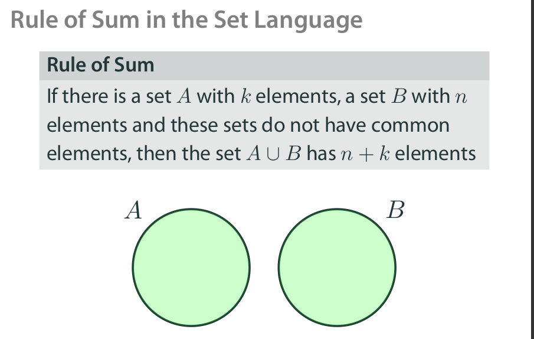

# Discrete Math and Analyzing Social Graphs

[Course Link](https://www.coursera.org/learn/discrete-math-and-analyzing-social-graphs/home/welcome)

## Table of Contents

- [Discrete Math and Analyzing Social Graphs](#discrete-math-and-analyzing-social-graphs)
  - [Table of Contents](#table-of-contents)
    - [Basic Combinatorics](#basic-combinatorics)
      - [Why Counting](#why-counting)
      - [Rule of Sum](#rule-of-sum)
      - [Convenient Language: Sets](#convenient-language-sets)
      - [Generalized Rule of Sum](#generalized-rule-of-sum)
      - [Recursive Counting: Number of Paths](#recursive-counting-number-of-paths)
      - [Rule of Product](#rule-of-product)
      - [Number of Tuples](#number-of-tuples)
      - [Set Language for Tuples](#set-language-for-tuples)
      - [Licence Plates](#licence-plates)
      - [Tuples with Restrictions](#tuples-with-restrictions)
      - [Permutations](#permutations)
      - [Combinatorics](#combinatorics)
    - [Advanced Combinatorics](#advanced-combinatorics)
      - [Binomial Theorem](#binomial-theorem)

### Basic Combinatorics

Suppose we need to **count** certain objects. Can we do anything better than just list all the objects? Do we need to create a list of all our data entries to check whether we have enough data to teach our ML model? Is there a way to tell whether our algorithm will run in a reasonable **time** before implementing and actually running it? All these questions are addressed by a mathematical field called **Combinatorics**. In this module we will give an introduction to this field that will help us to answer basic versions of the above questions.

**Learning Objectives**:

- Use basic methods of `combinatorics to count` objects.
- Apply standard operations on `sets`.
- `Categorize basic combinatorial` problems into standard settings.
- Apply basic `combinatorial methods` in programming.

[Slides Link](https://d3c33hcgiwev3.cloudfront.net/ixF2zIsPRmuRdsyLDyZrdQ_2d9654a3d8414750818f3bdaf93b3cab_basic_counting_tecniques.pdf?Expires=1623974400&Signature=Ao9Q8cxzE7jgN9IOsjvc602Ho3W32d9oQHQqSHLZhlEVYqTUGmjcjnwZlRkr8j2f3PnCLWZiXZgtrZttiMk8d5DyDbFdSzE8JYHcbPYmSH~aO2wAlZdClwwTJyuCjYiNimGtU1RL5C8zIGFaInrZ22nSc-hiUrE8lCANZm3Ngoc_&Key-Pair-Id=APKAJLTNE6QMUY6HBC5A)

#### Why Counting


#### Rule of Sum


**Rule of Sum in Programming**:

```js
for _ in range(8):
        print("Hi!")
for _ in range(4):
        print("Hi!")
for _ in range(7):
        print("Hi!")
```

If we run this code, how many times the word 'Hi!' will be printed? Try to answer without actually running the code.

**Answer**: 8 + 4 + 7 = 19

**Numbers Divisible by 2 or 3**

```py
# Number Divisible by 2
# How many numbers from 1 to 20, inclusive, are divisible by 2?
# How many numbers from 1 to 20, inclusive, are divisible by 3?
# How many numbers from 1 to 20, inclusive, are divisible by 2 or by 3?

divisible_by_2 = 0
divisible_by_3 = 0
divisible_by_2_or_3 = 0

for i in range(1,21):
    if i % 2 == 0:
        divisible_by_2 += 1

    if i % 3 == 0:
        divisible_by_3 += 1

    if i % 2 == 0 or i % 3 == 0:
        divisible_by_2_or_3 += 1

print(divisible_by_2) # 10
print(divisible_by_3) # 6
print(divisible_by_2_or_3) # 13
```

#### Convenient Language: Sets


How many elements does the set `A={1,1,1,1}` contain?
**Answer**: `1`


```py
# Consider the set A={1,3,2,0,1,3}. Find ∣A∣.
A = {1,3,2,0,1,3}

# length of |A|
print(len(A)) # 4

# subset
A = {1,3,4,7,10,11}

# =============== Subset ==================== #
# Checking if A is subset of B (vice versa)
# Returns True
# A is subset of B
B = {1, 7, 11}
print(B.issubset(A)) # True

B = {1, 3, 4, 8}
print(B.issubset(A)) # False

B = set()
print(B.issubset(A)) # True

B = {1, 3, 4, 7, 10, 11}
print(B.issubset(A)) # True

# =========== Intersection and Union ================== #
A = {1,2,4,5,6}
B = {1,2,3,5,7}

print(A.intersection(B)) # {1,2,5}
print(A.union(B)) # {1,2,3,4,5,6,7}

# =============== Element  ================ #
# If some object 𝑥 is an element of 𝐴 we write 𝑥 ∈ 𝐴
print (2 in A) # True
print(3 in B) # True
print(3 in A) # False
```

#### Generalized Rule of Sum

If there are finite sets `𝐴` and `𝐵`, then `|𝐴 ∪ 𝐵| = |𝐴| + |𝐵| − |𝐴 ∩ 𝐵|`




- Suppose we have 40 videos in our dataset. Each video falls in at least one of the two categories, comedy videos and music videos. It is known that there are 27 comedy videos and 22 music videos in the dataset. How many videos fall into both categories?

```py
# Rule of Sum
# If there are finite sets 𝐴 and 𝐵, then |𝐴 ∪ 𝐵| = |𝐴| + |𝐵| − |𝐴 ∩ 𝐵|

# Here,
# |A U B| = ?
# |A| = 27
# |B| = 22

# According to general rule of sum,

fall_into_both_categories = 27 + 22 - 40
print(fall_into_both_categories) # 9
```

#### Recursive Counting: Number of Paths


**Question**:


**Answer**: 3 + 2 + 3 => 8


#### Rule of Product

If there are `𝑘` object of the first type and there are `𝑛` object of the second type, then there are `𝑘 × 𝑛` **pairs** of objects, the first of the first type and the second of the second type.


```py
# Question 1
# Suppose we have "7" disjoint datasets and each dataset contains
"12" data entries. How many data entries do we have in total?

no_of_datasets = 7
no_of_entries_in_each_dataset = 12

# How many entries in total
# Using rule of product,

total_entries = no_of_datasets * no_of_entries_in_each_dataset
print(total_entries) # 84
```


```py
# What is the number of segments in the picture below? Each segment joins two circles.

upper_segment_node = 6
lower_segment_node = 7

total_segments = upper_segment_node * lower_segment_node
print(total_segments) # 42
```

```py
for _ in range(4):
        for _ in range(4):
                print("Hello world!")
for _ in range(7):
        for _ in range(3):
                print("Hello world!")
```

- If we run this code, how many times the phrase 'Hello world!' will be printed? Try to answer without actually running the code..

**Answer**: (`(4 * 4)` `+` `(7 * 3)`) => (`16` `+` `21`) => `37` 

#### Number of Tuples

**Number of Passwords**:

How many different 5-symbol passwords can we create using lower case Latin letters only? (the size of the alphabet is 26)

**Answer**: 26 * 26 * 26 * 26 * 26 = `11 881 376`

> Suppose we have a set of `𝑛` symbols. How many different **sequences** of length `𝑘` we can form out of these symbols?

These **sequences** are usually called **tuples**.

- There are `𝑛` possibilities to pick the first letter.
- Each next letter multiplies the number of sequences
by `𝑛`.
- Thus the answer is a product of `𝑛` by itself `𝑘` times, that
is `𝑛^𝑘`

#### Set Language for Tuples


#### Licence Plates


#### Tuples with Restrictions


#### Permutations 

**Problem**:

Suppose we have a set of `𝑛` **symbols**. How many different **sequences** of length `𝑘` we can form out of these symbols if we are not allowed to use the same symbol **twice**?

- Tuples of length `𝑘` without repetitions are called **𝑘-permutations**.
- Observe that if `𝑛 < 𝑘`, then there are `no` 𝑘-permutations: there are simply not enough different letters.

- So it is enough to solve the problem for the case `𝑘 ≤ 𝑛`.


```py
# Tuples

# Number of Passwords
# How many different 5-symbol passwords can we create using lower case Latin letters only? (the size of the alphabet is 26)

def no_of_passwords(k=0):
    """
        All are lowercase english alphabet. So for each position we have 26 possibilities.  
    
        length_of_passwords = 5
        each_position_no_of_possibilities = 26
    """
    n = 26
    k = 5

    return n**k

def cartesian_products(A, B):
    cross_product = []

    for x in A:
        for y in B:
            cross_product.append((x, y))
    
    return cross_product
 
def number_with_exactly_one_7_digits(n = 0):
    import math
    return math.factorial(n) 

if __name__ == "__main__":
    print(no_of_passwords(k=5)) # 11881376
    print(cartesian_products(A={1,2,3}, B={2,3,4}))
    # [(1, 2), (1, 3), (1, 4), (2, 2), (2, 3), (2, 4), (3, 2), (3, 3), (3, 4)]
    print(number_with_exactly_one_7_digits(n=10))# 3628800
```

#### Combinatorics

**Ranking Problems**:
Suppose we have `𝑛` texts and we need to `rank` them by relevance. One of the standard approaches requires to `compare each text with each other`. How many **comparisons** we need to make?

```py
def ranking(n: int) -> int:
    """
        Compare each text with each other.
        Example: Suppose we have 3 text. 'a', 'b', and 'c'.
        Our solution gives us 3 * 2 = 6 comparisons, because we compare
        each text to other. But if we further review our solutions we see we count same or doing same comparison twice!

        HOW WE SOLVE!!!

        Solve: If we counted each objects k times, just divide the result k times.
    """
    return n * (n - 1) /  2

```


> If we counted each objects `k` times, just **divide** the result by `k`.

**Calculate Permutations**:


```py
def combination(n: str, k: int) -> int:
    """
        Return the combination of (n, k) -> 'n choose k'
    """
    # return math.factorial(n) / (math.factorial(k) * math.math.factorial(n - k))
    return list(itertools.combinations(n, k))
```

**Road Trip Problems**:

You are planning a road trip. You have `5` friends, but you can fit only `3` of them in your car. How many ways do you have to do it?


```py
def road_trip(friends: list, k: int):
    """
        friends: str, list or iterables
        k: int, choose number
        return combination of len(friends) and k or "n choose k"
    """
    return list(itertools.combinations(friends, k))

friends = ['mahin', 'bijoy', 'mony', 'nahid', 'hassan']
k = 3
print(road_trip(friends, k))
"""
[('mahin', 'bijoy', 'mony'),
 ('mahin', 'bijoy', 'nahid'),
 ('mahin', 'bijoy', 'hassan'),
 ('mahin', 'mony', 'nahid'),
 ('mahin', 'mony', 'hassan'),
 ('mahin', 'nahid', 'hassan'),
 ('bijoy', 'mony', 'nahid'),
 ('bijoy', 'mony', 'hassan'),
 ('bijoy', 'nahid', 'hassan'),
 ('mony', 'nahid', 'hassan')]
"""
```

**Usages of Combination**:


**Quiz**:

- Suppose we have a dataset of size `12` and we want to construct a subset of data of size `6`. How many ways do we have to do it?

```py
import itertools

def split_dataset(n: list, k: int):
    """
        We need to unordered tuple for this solution. Because 2 files in 
        different position don't make new subset of dataset. 
    12C6 = 12! / (6! * (12-6)!) = 924
    """
    return len(list(itertools.combinations(n, k)))
split_dataset(range(1, 13), 6) # 924
```

- Suppose we have a dataset of size `12` and we want to split it into `two subsets` of data of size `6` (and it does not matter, which of the subsets is the `first and which is the second`). How many ways do we have to do it?

```py
924 * 2
```

**Note**: [Learn Permutation and Combination from Onnorokom Pathshala](https://www.youtube.com/watch?v=VTZHMZ3MmfA&list=PLxSt9YDBipm4wM6KZHte2w68WUwgRWY5H)

### Advanced Combinatorics

#### Binomial Theorem